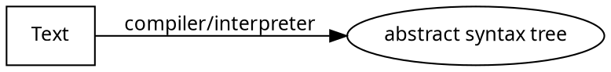
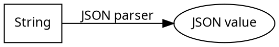

# Parser Combinator!

### Agenda

- Parser representation
- Cat-parse library
- Parser combinator in Lox

---

## What is a parser?





---


### Parser representation

What is the type representation for parser?

---

### The first try

```Scala
type Parser[A] = String => A
```

---

### Better version

```Scala
type Parser[A] = String => Either[ParserError, A]
```

---

### Probably the best?

```scala
type Parser[A] = String => Either[ParserError, (String, A)])
```

---

### Parser Combinator library

[cat-parse](https://github.com/typelevel/cats-parse)

```
sealed abstract class Parser[+A] {
  final def parse(str: String): Either[Parser.Error, (String, A)]

  // Attempt to parse all of the input `str` into an `A` value.
  final def parseAll(str: String): Either[Parser.Error, A]
}
```

---

### Predefined Parser

```
    // Parser.char('a').parse("abc") => Right(("bc", 'a'))
    def char(c: Char): Parser[Char]

    // Parser.string("hello").parse("hello world") => Right((" world", "hello"))
    def string(str: String): Parser[String]

    // Parser.charIn('a', 'b', 'c').parse("bca") => Right(("ca", 'b'))
    def charIn(c0: Char, cs: Char*): Parser[Char] =

```

---
### Predefined Parser

```
    // A-Z and a-z, without diacritics
    def Parser.alpha: Parser[Char]

    // 0-9
    def Parser.digit: Parser[Char]

```
---
### Combinators

```
sealed abstract class Parser[+A] {
  // val p = Parser.string("hello").map(s => s ++ " parser")
  // p.parser("hello world") => Right((" world", "hello parser"))
  def map[B](fn: A => B): Parser[B]

  // val p = Parser.string("hello").as("Xin chao")
  // p.parser("hello world") => Right((" world", "Xin chao"))
  def as[B](b: B): Parser[B]
}

```

---
### Combinators

```
sealed abstract class Parser[+A] {
  // val p = Parser.char('a') | Parser.char('b')
  // p.parser("bca") => Right(("ca", 'b'))
  def |(that: Parser[A]): Parser[A]

  //Sequence another parser after this one, combining
  // both results into a tuple.
  // val p = Parser.char('a') ~ Parser.char('b')
  // p.parser("abc") => Right(("c", ('a', 'b')))
  def ~[B](that: Parser[B]): Parser[(A, B)] =

}

```

---
### Combinators

```
sealed abstract class Parser[+A] {
  // val p = Parser.not(Parser.char('a'))
  // p.parser("bca") => Right(("ca", Unit))
  // p.parser("abc") => Left(ParserError(...))
  def not(pa: Parser[Any]): Parser[Unit] =

  // parse zero or more characters as long as they don't match p
  def until0(p: Parser[Any]): Parser[String] =
  // parse 1 or more characters as long as they don't match p
  def until(p: Parser[Any]): Parser[String] =
}
```
---

### Combinators

```
sealed abstract class Parser[+A] {
   def oneOf[A](parsers: List[Parser[A]]): Parser[A] = {

  def rep0: Parser[List[A]]
  def rep: Parser[NonEmptyList[A]]
}
```
---
### Combinators

```
sealed abstract class Parser[+A] {

  // discard the value in the parser
  // Parser.char('a').void.parse("abc") => Right(("bc", Unit))
  def void: Parser0[Unit] =

  // x *> y` is equivalent to `(x.void ~ y).map(_._2)`.
  def *>[B](that: Parser[B]): Parser[B] =

  // `x <* y` is equivalent to `(x ~ y.void).map(_._1)`.
  def <*[B](that: Parser[B]): Parser[A] =

}
```
